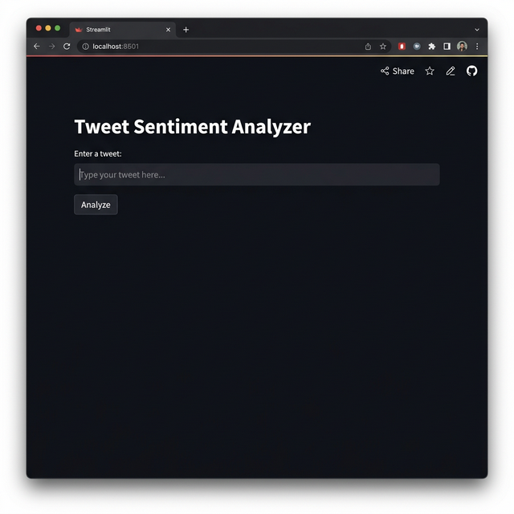

# Tweet Sentiment Analysis

A machine learning project that classifies tweets as **positive** or **negative** using Natural Language Processing (NLP). The model is trained on the [Sentiment140](http://help.sentiment140.com/for-students) dataset containing 1.6 million tweets. It uses TF-IDF vectorization and a classification model to predict sentiment in real time through a Streamlit web interface.



## Try It Online

The app is deployed on Streamlit Community Cloud. You can use it directly in your browser without any setup:

[Open Tweet Sentiment Analyzer](https://dev-s-shah-tweet-sentiment-analysis.streamlit.app/)

## Run Locally

### Prerequisites

- Python 3.8+
- pip

### Steps

1. **Clone the repository**

   ```bash
   git clone https://github.com/DEV-S-SHAH/tweet-sentiment-analysis.git
   cd tweet-sentiment-analysis
   ```

2. **Install dependencies**

   ```bash
   pip install -r requirements.txt
   ```

3. **Train the model** (optional, pre-trained files are included)

   Open `sentiment.ipynb` in Jupyter Notebook and run all cells. This generates `sentiment_model.pkl` and `tfidf_vectorizer.pkl`.

4. **Run the app**

   ```bash
   streamlit run app.py
   ```

   The app will open at `http://localhost:8501`.

## How It Works

1. Tweets are preprocessed by removing URLs, mentions, hashtags, numbers, punctuation, and stopwords, followed by lemmatization.
2. Text is converted to numerical features using TF-IDF vectorization.
3. A trained classification model predicts the sentiment as Positive or Negative.

## Project Structure

```
.
├── app.py                  # Streamlit web application
├── sentiment.ipynb         # Model training notebook
├── sentiment_model.pkl     # Trained model
├── tfidf_vectorizer.pkl    # Fitted TF-IDF vectorizer
├── requirements.txt        # Python dependencies
└── .gitignore
```

## Dependencies

- streamlit
- scikit-learn
- pandas
- numpy
- nltk

## License

This project is open source and available under the [MIT License](LICENSE).
